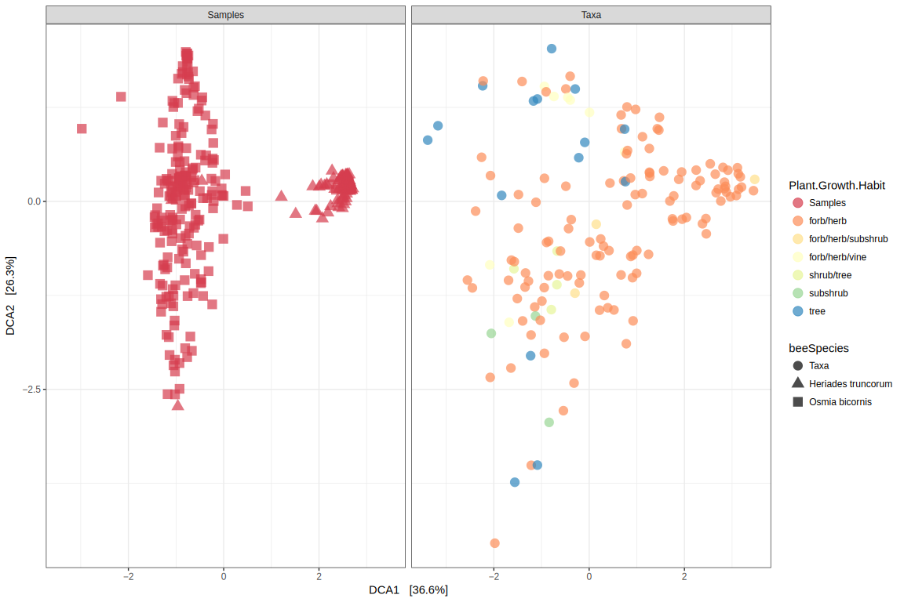
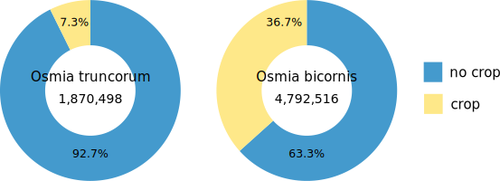

.. user:
.. _user:

User manual
===========

.. _quick-start-reference-label:

Quick start
-----------

To learn the main features of Fennec from a user perspective navigate your webbrowser to the public instance at https://fennec.molecular.eco
The first thing you see is the startpage

.. image:: screenshots/startpage.png

The boxes show the number of organisms and trait entries in the current database.
You can explore the organisms and traits in the database by using the navigation on the left hand side.
However, in order to analyze projects it is necessary to log in (in the top right corner).
You can login using your GitHub account or register a free Fennec account.

After login navigate to projects.
If it is your first login the project table will be empty.
Otherwise your projects show up here.
To upload a new project in biom format just click the ``Browse`` Button and select the file.

.. image:: screenshots/projects.png

Details on file formats are available in the :ref:`upload-own-data-reference-label` section.
Use this :download:`demo biom file <example/CaseStudy2017.biom>` to follow along the tutorial.
It consists of 324 samples of pollen with a total of 216 OTUs.

To get to the project page click on the link in the first column of the project table `Case Study 2017`.
This will bring you to the project details page.

.. image:: screenshots/project_details.png

Basic information about the project is displayed in the table.
However, when you navigate on the traits tab you'll see empty tables.
This is because the organisms in the project are not mapped to entities in the database, yet.
So head to the mapping tab and select:

Map ``OTUs`` by ``ncbi_taxid`` on ``NCBI taxid`` and click ``GO``.

The result of the mapping will be displayed below where a click on ``Save in database`` will make this mapping persistent.

.. image:: screenshots/project_mapping.png

Now that the OTUs are mapped to organisms in the database switching to the ``Traits`` tab will show available traits.
By clicking on the icon in the details column for a trait (e.g. ``Plant Habit``) you come to a page summarizing the trait values in this community.
On this page trait values of all species present in any of the samples are summarized (without taking abundance into account).
The trait values can be added to the project either via the ``Add trait to OTU metadata`` button on this page or the ``+`` icon in the trait table.

.. image:: screenshots/project_traits.png

Finally it is possible to interactively explore the trait values by navigating to the ``Inspect with Phinch`` tab.
The first screen on this tab is the filter page which you can leave via the ``Proceed To Gallery`` button in the top right corner.
You can select any of the visualizations.
Taxonomy is derived from your original biom file and not altered by Fennec.
The traits you added can be selected in the top right corner of each visualization (except in the Sankey Diagram).

.. image:: screenshots/project_phinch.png

Download of the enriched community data is possible in different formats via the ``Project overview`` tab.
For a more in depth analysis of this dataset see the :ref:`pollen-case-study-reference-label`.

.. _upload-own-data-reference-label:

Upload own data
---------------

It is possible to upload your own projects into FENNEC.
By default those projects are only visible to you.
There are a couple of features corrently in development that will enhance management of your own data, including upload of own traits and sharing of projects.

Projects
^^^^^^^^

Internally FENNEC stores projects in BIOM (1.0) format.
By integrating the `biom-conversion-server <https://github.com/molbiodiv/biom-conversion-server>`_ it is also possible to upload projects in BIOM 2.x and even tabular (tsv) format.

BIOM
""""

Upload in BIOM format should be straight forward.
After login navigate to the 'Projects' page and on the top of the page hit the 'Browse' button under 'Upload projects'.
There select one or more biom files (can be 1.0, 2.x, or a mixture).
After you close the file selection dialog a message will appear, telling you '1 project uploaded successfully' and the project(s) will show up in the table.

You can upload BIOM files containing all of your metadata (e.g. files previously exported from FENNEC).
Alternatively, you can also upload BIOM files that only contain your observation matrix and add metadata later.
More details about the latter approach is given in the next section.

Table (tsv)
"""""""""""

It is also possible to upload the observation matrix of a project in tsv (tab separated values) format.
No metadata can be included in this table, instead all metadata needs to be added afterwards.

The process of uploading the observation tsv file and adding metadata is demonstrated with an example (Warning: no real data, do not look for biological signals).
Given your observation matrix stored in a file called :download:`otu_table.tsv <example/otu_table.tsv>` looks like this::

    #OTUId	Sample1	Sample2	Sample3	Sample4
    OTU1	33	76	12	8
    OTU2	50	44	17	23
    OTU3	9	99	15	55
    OTU4	1	63	39	54

After normal upload on the project page it will appear in the table with ID 'None'.
When you click the project you will see on the details page that upload was successful (you have 4 OTUs and 4 Samples).
You can use the little pen icon beside 'Project overview' to edit the 'ID' and 'Comment' for the project.

However, as it is you can not do much with this project.
To use the traits from FENNEC you need some way to map your OTUs (and/or samples) to organisms in the database.
For this purpose we need to add metadata.
So, assuming we have the following metadata files (also in tsv format), :download:`otu_metadata.tsv <example/otu_metadata.tsv>`::

    #OTUId      Scientific Name
    OTU1        Bellis perennis
    OTU2        Centaurea cyanus
    OTU3        Medicago sativa
    OTU4        Plantago lanceolata

and :download:`sample_metadata.tsv <example/sample_metadata.tsv>`::

    #Sample     Bee     Season
    Sample1     Osmia caerulescens      Spring
    Sample2     Megachile rotundata     Spring
    Sample3     Osmia caerulescens      Summer
    Sample4     Megachile rotundata     Summer

We can click the 'Metadata overview' tab and there we can add observation and sample metadata by sequentially clicking the 'Browse' buttons and selecting our respective tsv files.
In both cases you should see a green message 'Successfully added metadata'.
Now you can proceed by clicking 'Explore Sample metadata' and 'Explore OTU metadata' to see that both were added successfully.

.. ATTENTION::

    By default the rows are ordered by 'Total Count' and not by 'ID'.

If we look on the 'Traits' tab we see, that both tables are still empty.
But now we can head to the 'Mapping' tab and connect our OTUs and Samples with the corresponding FENNEC organisms in the database.
First select:

Map ``OTUs`` by ``Scientific Name`` on ``Scientific name``

and hit ``GO``. If only ``ID`` is available in the second drop down, please reload the page.
The Result should be that all 4 organisms have a scientific name and could be mapped to fennec_ids.
So click the ``Save in database`` button to permanently store this mapping.
After that the page should reload automatically and the bar for OTUs should show 100% mapped.
Repeat those steps with ``Samples`` by ``Bee`` on ``Scientific name`` (do not forget to ``Save in database``).

Now the tables on the 'Traits' tab are properly populated.
You can inspect them and add them to your project.
Lets add a couple of trais (using the ``+`` icon) for the OTUs and Samples

OTUs:

* Plant Growth Habit
* Life Cycle Habit
* Dispersal Vector

Samples:

* Sex ratio
* Foraging mode

Now it is time to 'Inspect with Phinch'.
You can accept the default filters by clicking the 'Proceed to Gallery' button in the top right corner.
Now select some visualizations and play around with the settings.

.. ATTENTION::

    The Sankey Diagram as well as the taxonomic rank selection in Phinch will not work.
    This is because Phinch expects taxonomy information to be available as metadata in the 'taxonomy' field for OTUs.
    We did not provide this information with our metadata table and it is not automatically added by FENNEC.
    If you want to use this feature as well upload this :download:`otu_taxonomy.tsv <example/otu_taxonomy.tsv>` file as additional OTU metadata.
    Don't worry, new metadata is added and will only overwrite existing metadata if it uses the same column name.

Traits
^^^^^^

Coming soon.

.. NOTE::

    You can already load project specific metadata using the ``Metadata overview`` tab on the project details page.

Case Studies
------------

This section shows possible use cases of Fennec by demonstrating the analysis of real world datasets.
More case studies are always welcome so if you want to add one feel free to suggest one.
We will gladly assist you in preparing and integrating everything (contact: markus.ankenbrand@uni-wuerzburg.de ).

.. _pollen-case-study-reference-label:

Pollination Ecology
^^^^^^^^^^^^^^^^^^^

This case study uses data from `Sickel et al. 2015 <https://doi.org/10.1186/s12898-015-0051-y>`_.
This is the data set also used for the :ref:`quick-start-reference-label` guide.
Use this :download:`biom file <example/CaseStudy2017.biom>` to reproduce this analysis.

Introduction
""""""""""""

In this study 384 pollen samples collected by two closely related solitary bee species of the Megachilidae were analyzed using next-generation sequencing, *Osmia bicornis* and *Osmia truncorum* (synonym *Heriades truncorum*).
One of the bee species, *O. bicornis* is known to be polylectic, while the other, *O. truncorum* is oligolectic (focusing on Asteraceae).
Although the data originates from next-generation sequencing, any community/network data can be used for the workflow independent of the method for data acquisition.

Three exemplary topics are to be addressed in this case study, with the first related to ecological interactions, followed by one concerning bio-monitoring and lastly one focusing on the socio-economic relevance:

1. **Are the two bee species showing preferences and differences between each other in growth habit types of visited plants?**
   Given the specialization of *O. truncorum* on Asteraceae (mainly forbs and herbs) one could hypothesize that this bee does not collect pollen from shrubs or trees.
   *O. bicornis* on the other hand collects from many different taxonomic plant groups.
   Is this reflected by a variety of growth habits or is there a specialization on plants of a specific growth habit, likewise to the other bee species?
   This hypotheses address the concept of a correlation between functional and taxonomic diversity of the visited plants.
2. **How many (and which) invasive species can be found in the samples?
   Are there vulnerable species in the samples?
   Is the amount of invasive and vulnerable species visited similar in all of the samples and by both species?**
   Monitoring the ranges of invasive as well as threatened plant species is an important task in conservation (`Darling et al. 2007 <https://doi.org/10.1007/s10530-006-9079-4>`_, `Stout et al. 2009 <https://doi.org/10.1051/apido/2009023>`_).
   Using pollen data collected by bees, presence of both types can be monitored by mapping conservation relevant traits to the network data.
   Further, pollination services by the bee species to both types can be identified.
3. **Which plants visited by the bees show agricultural relevance to humans and what is their relative amount compared to the remaining plant species?**
   Bees provide pollination services to agriculturally relevant plants (`Klatt et al. 2013 <https://doi.org/10.1098/rspb.2013.2440>`_).
   Using traits like *agricultural usage* allows to identify how specific the respective bees were in visiting such plants.
   On the other hand, solitary bees are important agents to ensure the pollination of wild plant species (`Garibaldi et al. 2013 <https://doi.org/10.1126/science.1230200>`_), and using these traits it can be monitored whether the bees are mainly attracted to mass flowering crops or also visit other plants in agriculturally shaped landscapes.

Methods
"""""""

The data has been downloaded from EBI-SRA project number PRJEB8640 and data preparation as well as taxonomic classification has been performed based on `Sickel et al. 2015 <https://doi.org/10.1186/s12898-015-0051-y>`_.
The full workflow has been deposited at https://github.com/molbiodiv/meta-barcoding-dual-indexing .
This resulted in a table with 1002 plant operational taxonomic units (OTU) and a total count of 6,979,584 observations (sequence reads).
For each OTU, the taxonomic lineage and NCBI-taxonomy-ID have been determined during this process by hierarchic taxonomic assignments using UTAX  (part of usearch, `Edgar 2010 <https://doi.org/10.1093/bioinformatics/btq461>`_).
OTUs with total count of less or equal than 50 across all samples were excluded from the analysis.
Samples with less than 10,000 sequence reads remaining have been removed as well.
Finally, the remaining 353 plant OTUs were combined if they corresponded to the same taxon.
The resulting table consists of 216 plant OTUs and 324 samples, which was imported into the Fennec.
The total number of reads in this final dataset is 6,663,014. For the plants, the obtained NCBI-taxonomy-ID was used to map the OTUs in the community to organisms in the Fennec database, which resulted in all 216 OTUs being successfully mapped.
For the samples, the corresponding bee species were mapped by the scientific name in the meta-data field "beeSpecies".

In the next step, values for "Plant Growth Habit", "EPPO Categorization", "World Crops Database", and "IUCN Red List" have been added to the project from the database.
This dataset including the traits has then been interactively visualized and analyzed using the built-in modified version of Phinch (`Bik et al. 2014 <https://doi.org/10.1101/009944>`_) according to the research questions described above.
Finally, the enriched dataset has been exported and imported into `R <https://www.r-project.org/>`_ using shiny-phyloseq (`McMurdie et al. 2015 <https://doi.org/10.1093/bioinformatics/btu616>`_) to demonstrate the usability of mapped data in further analyses tools.
In particular a DCA ordination has been calculated and visualized with colorization by the trait "Plant Growth Habit".
For this purpose OTUs with missing trait values and those with rare variants (keeping only forb/herb, tree, subshrub, shrub/tree, forb/herb/subshrub, forb/herb/vine) were filtered.

Results and Discussion
""""""""""""""""""""""

To show the potential of the Fennec to be used in ecological analysis, we conducted a case study as proof-of-concept for a pollen meta-barcoding data.
We address multiple ecological questions and highlights some use cases, where automatic integration of public trait data with the FENNEC has been performed.

**Are the two bee species showing preferences and differences between each other in growth habit types of visited plants?**

A breakdown of the trait "Plant Growth Habit" for the two bee species separately (visualized via "Donut Partition Chart") reveals that for *O. truncorum* 89% of the taxonomic assignments were mappable to the trait, which resulted in absolute a dominance of "forb/herb" with 87% This matches our expectations as this bee is specialized on Asteraceae which mostly show this habit.
For *O. bicornis*, 95% of the sequence data was assignable to "Plant Growth Habit", also with "forb/herb" with 65% being the most abundant, but a still considerable amount of 24% as "tree".
Likewise to taxonomic specialization, no indication for a specialization on a specific plant growth habit is apparent.
Another interesting observation is the trait coverage when taking abundance into account.
While only 85% of OTUs have a value for "Plant Growth Habit", those OTUs contribute 93% to the entire community.
Thus the OTUs with missing trait are relatively rare in the community, with the more abundant ones being well-studied in terms of trait data.
Automatically mapped trait data also helps in interpretation of beta-diversity turnover between samples, here collected pollens.
For example, ordinations can be visualized with trait data, in our case "Plant Growth Habit", as a split-plot with samples shaped by bee species and plant taxa colored by Plant Growth Habit.
In our case study, samples are separated as expected by bee species on the first ordination axis with all samples from *O. truncorum* mostly isolated on the right hand side.
OTUs localized similarly with possible values for ordination axis 1 were almost exclusively forbs and herbs. The variation of this bee species on the second axis is negligible.
For *O. bicornis* there is a substantial spread particularly on the second axis, where plants of type tree seem to concentrate in the upper part. The trait data helps to understand the ecology behind the dataset, indicating plant turnover and eventually also location and landscape changes to be represented on the second axis.

    Splitplot of a DCA ordination. Samples are in the left facet with shapes according to by bee species. OTUs are in the right facet with points colored by growth habit (filtered for most common growth habits, species with missing trait have been removed). Samples split nicely by bee on the first axis with *O. truncorum* on the right hand side. The OTUs on the right hand side of the ordination are as expected mainly forb/herb. For *O. bicornis* there is a substantial spread on the second axis.

**How many (and which) invasive species can be found in the samples? Are there vulnerable species in the samples? Is the amount of invasive and vulnerable species visited similar in all of the samples and by both species?**

The trait "EPPO Categorization" was mapped to our pollen collection data to determine if and to what extend the samples contain species that are regarded as invasive in Europe.
One of the visualization methods of the Phinch suite that is integrated  into the Fennec the "Bubble Chart", has been applied to explore this trait. It reveals three samples containing high numbers of invasive species (PoJ74, PoJ236, PoJ244).
Further inspection with the integrated meta-data tables showed that PoJ74 and PoJ244 have more than 1000 counts of *Solidago canadensis*, each while PoJ236 has a count of 2779 for *Helianthus tuberosus*.
The trait data is thus sortable regarding abundance of specific traits, referable to organism information but also to samples and their corresponding geographical locations if the data has been collected in such way.
It might thus serve as indicator for occurrence of invasive species in geographic regions and used to monitor the spread of invasive species over space and time.
Regarding the occurrence of species with respect to threat status, the pollen data was automatically mapped to the IUCN red list data and the distribution of vulnerable species (as listed by the IUCN) across samples was visualized using the "Bubble Chart", but also a "Taxonomy Bar Chart".
These charts illustrate that multiple samples consist almost entirely of "near threatened" species, particularly *Juglans regia*, the english walnut, which experienced strong declines through anthropogenic overuse and lack of replacement plantings.
As indicated by the data, it served as a major nutrient source for individual investigated bees.

**Which plants visited by the bees are agriculturally relevant to humans and what is their relative amount compared to the remaining plant species?**

Finally ecologists (especially in the field of conservation) are often in the difficult situation to somehow quantify economic value of ecosystem services like pollination (`Hanley et al. 2015 <https://doi.org/10.1016/j.ecoser.2014.09.013>`_).
The Fennec helps in addressing such socio-economic questions by including human usage (as crop) as a trait.
All plants listed in the `World Crops Database <http://world-crops.com/>`_ are known to be cultivated by humans for specific purposes.
The "Donut Partition Chart" for this trait reveals that 36.7% of plants collected by *O. bicornis* and 7.3% of plants collected by *O. truncorum* are listed in that database.
This does not yet give more information like the category of crop (e.g. fruits, vegetables, nuts, wood product, etc.) or a real monetary quantification.
However this is not a limitation of Fennec but of the underlying data
(i.e. if this data is available it can be imported into Fennec and is then automatically available for the community of interest).

    Partition donut charts for the trait "World Crops Database" separated by bee species. Plot has been created with the built in modified version of Phinch.

Pollination Network
^^^^^^^^^^^^^^^^^^^

This case study uses data from `Bell et al. 2017 <https://doi.org/10.3732/Fapps.1600124>`_.
Use this :download:`biom file <example/Bell_et_al_2017_ITS2.biom>` to reproduce this analysis.

Microbiome Study
^^^^^^^^^^^^^^^^

This case study uses data from `Song et al. 2013 <https://doi.org/10.7554/eLife.00458>`_.
Use this :download:`biom file <example/Song_et_al_2013.biom>` to reproduce this analysis.
