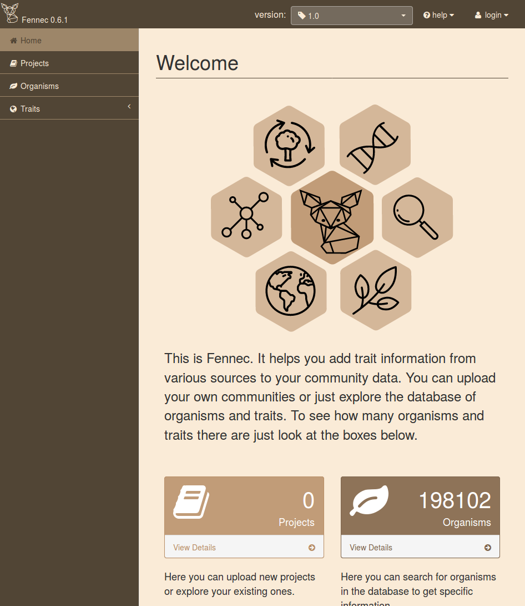
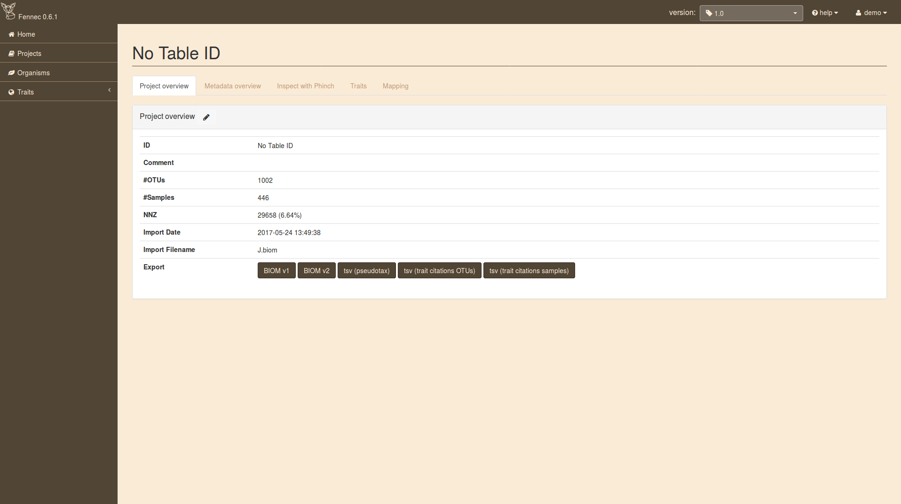
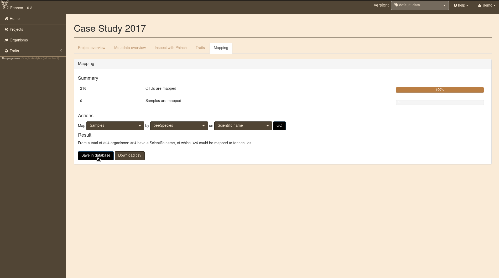
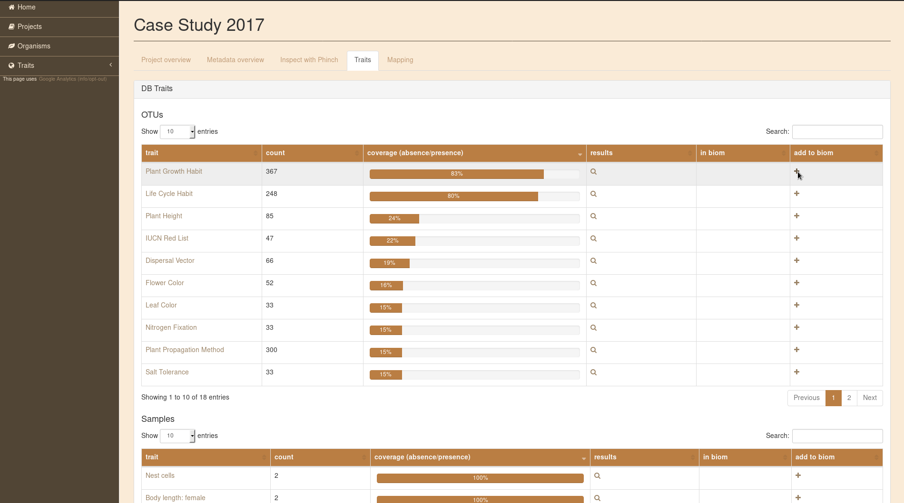
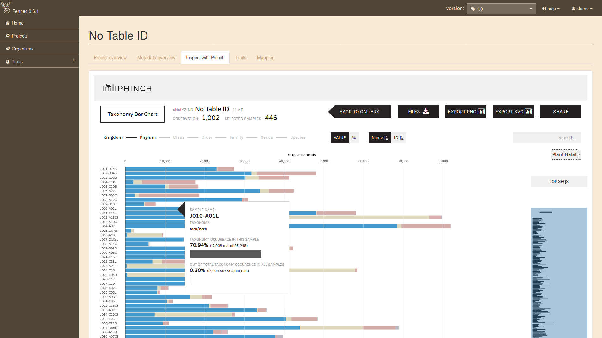

.. user:
.. _user:

User manual
===========

Quick start
-----------

To learn the main features of Fennec from a user perspective navigate your webbrowser to the public instance at https://fennec.molecular.eco
The first thing you see is the startpage

The boxes show the number of organisms and trait entries in the current database.
You can explore the organisms and traits in the database by using the navigation on the left hand side.
However, in order to analyze projects it is necessary to log in (in the top right corner).
You can login using your GitHub or Google account.
Some instances also provide a demo user (look on the page for information).

After login navigate to projects.
If it is your first login the project table will be empty.
Otherwise your projects show up here.
To upload a new project in biom format just click the ``Browse`` Button and select the file.

.. image:: screenshots/projects.png

Details on file formats are available in the "Import Project" section TODO:ref
Upload this `demo biom file <https://raw.githubusercontent.com/molbiodiv/fennec/master/doc/beta/J.biom>`_ to follow along the tutorial.
It consists of 446 samples of pollen with a total of 1002 OTUs.

To get to the project page click on the link in the first column of the project table `No Table ID`.
This will bring you to the project details page.

Basic information about the project is displayed in the table.
However, when you navigate on the traits tab you'll see empty tables.
This is because the organisms in the project are not mapped to entities in the database, yet.
So head to the mapping tab and select:

Map ``OTUs`` by ``ncbi_taxid`` on ``NCBI taxid`` and click ``GO``.

The result of the mapping will be displayed below where a click on ``Save in database`` will make this mapping persistent.
For more details about mapping see the section in the tutorial TODO:ref

Now that the OTUs are mapped to organisms in the database switching to the ``Traits`` tab will show available traits.
By clicking on the icon in the details column for a trait (e.g. ``Plant Habit``) you come to a page summarizing the trait values in this community.
On this page trait values of all species present in any of the samples are summarized (without taking abundance into account).
The trait values can be added to the project either via the ``Add trait to OTU metadata`` button on this page or the ``+`` icon in the trait table.

Finally it is possible to interactively explore the trait values by navigating to the ``Inspect with Phinch`` tab.
The first screen on this tab is the filter page which you can leave via the ``Proceed To Gallery`` button in the top right corner.
You can select any of the visualizations.
Taxonomy is derived from your original biom file and not altered by Fennec.
The traits you added can be selected in the top right corner of each visualization (except in the Sankey Diagram).

Download of the enriched community data is possible in different formats via the ``Project overview`` tab.

Upload own data
---------------

It is possible to upload your own projects into FENNEC.
By default those projects are only visible to you.
There are a couple of features corrently in development that will enhance management of your own data, including upload of own traits and sharing of projects.

Projects
^^^^^^^^

Internally FENNEC stores projects in BIOM (1.0) format.
By integrating the `biom-conversion-server <https://github.com/molbiodiv/biom-conversion-server>`_ it is also possible to upload projects in BIOM 2.x and even tabular (tsv) format.

BIOM
""""

Upload in BIOM format should be straight forward.
After login navigate to the 'Projects' page and on the top of the page hit the 'Browse' button under 'Upload projects'.
There select one or more biom files (can be 1.0, 2.x, or a mixture).
After you close the file selection dialog a message will appear, telling you '1 project uploaded successfully' and the project(s) will show up in the table.

You can upload BIOM files containing all of your metadata (e.g. files previously exported from FENNEC).
Alternatively, you can also upload BIOM files that only contain your observation matrix and add metadata later.
More details about the latter approach is given in the next section.

Table (tsv)
"""""""""""

It is also possible to upload the observation matrix of a project in tsv (tab separated values) format.
No metadata can be included in this table, instead all metadata needs to be added afterwards.

The process of uploading the observation tsv file and adding metadata is demonstrated with an example (Warning: no real data, do not look for biological signals).
Given your observation matrix stored in a file called :download:`otu_table.tsv <example/otu_table.tsv>` looks like this::

    #OTUId	Sample1	Sample2	Sample3	Sample4
    OTU1	33	76	12	8
    OTU2	50	44	17	23
    OTU3	9	99	15	55
    OTU4	1	63	39	54

After normal upload on the project page it will appear in the table with ID 'None'.
When you click the project you will see on the details page that upload was successful (you have 4 OTUs and 4 Samples).
You can use the little pen icon beside 'Project overview' to edit the 'ID' and 'Comment' for the project.

However, as it is you can not do much with this project.
To use the traits from FENNEC you need some way to map your OTUs (and/or samples) to organisms in the database.
For this purpose we need to add metadata.
So, assuming we have the following metadata files (also in tsv format), :download:`otu_metadata.tsv <example/otu_metadata.tsv>`::

    #OTUId      Scientific Name
    OTU1        Bellis perennis
    OTU2        Centaurea cyanus
    OTU3        Medicago sativa
    OTU4        Plantago lanceolata

and :download:`sample_metadata.tsv <example/sample_metadata.tsv>`::

    #Sample     Bee     Season
    Sample1     Osmia caerulescens      Spring
    Sample2     Megachile rotundata     Spring
    Sample3     Osmia caerulescens      Summer
    Sample4     Megachile rotundata     Summer

We can click the 'Metadata overview' tab and there we can add observation and sample metadata by sequentially clicking the 'Browse' buttons and selecting our respective tsv files.
In both cases you should see a green message 'Successfully added metadata'.
Now you can proceed by clicking 'Explore Sample metadata' and 'Explore OTU metadata' to see that both were added successfully.

.. ATTENTION::

    By default the rows are ordered by 'Total Count' and not by 'ID'.

If we look on the 'Traits' tab we see, that both tables are still empty.
But now we can head to the 'Mapping' tab and connect our OTUs and Samples with the corresponding FENNEC organisms in the database.
First select:

Map ``OTUs`` by ``Scientific Name`` on ``Scientific name``

and hit ``GO``. If only ``ID`` is available in the second drop down, please reload the page.
The Result should be that all 4 organisms have a scientific name and could be mapped to fennec_ids.
So click the ``Save in database`` button to permanently store this mapping.
After that the page should reload automatically and the bar for OTUs should show 100% mapped.
Repeat those steps with ``Samples`` by ``Bee`` on ``Scientific name`` (do not forget to ``Save in database``).

Now the tables on the 'Traits' tab are properly populated.
You can inspect them and add them to your project.
Lets add a couple of trais (using the ``+`` icon) for the OTUs and Samples

OTUs:

* Plant Growth Habit
* Life Cycle Habit
* Dispersal Vector

Samples:

* Sex ratio
* Foraging mode

Now it is time to 'Inspect with Phinch'.
You can accept the default filters by clicking the 'Proceed to Gallery' button in the top right corner.
Now select some visualizations and play around with the settings.

.. ATTENTION::

    The Sankey Diagram as well as the taxonomic rank selection in Phinch will not work.
    This is because Phinch expects taxonomy information to be available as metadata in the 'taxonomy' field for OTUs.
    We did not provide this information with our metadata table and it is not automatically added by FENNEC.
    If you want to use this feature as well upload this :download:`otu_taxonomy.tsv <example/otu_taxonomy.tsv>` file as additional OTU metadata.
    Don't worry, new metadata is added and will only overwrite existing metadata if it uses the same column name.

